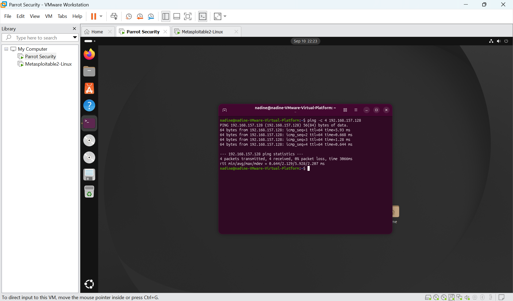
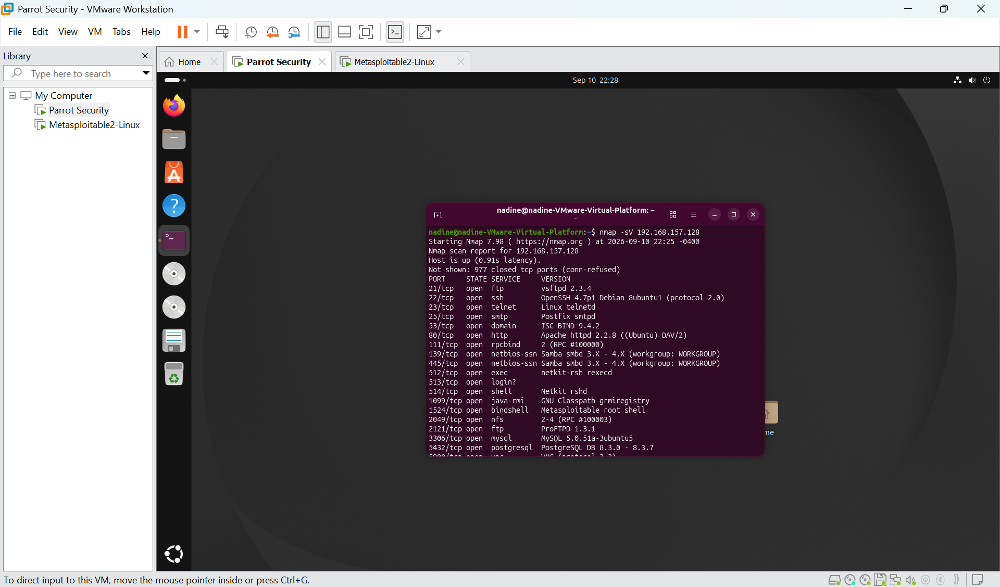
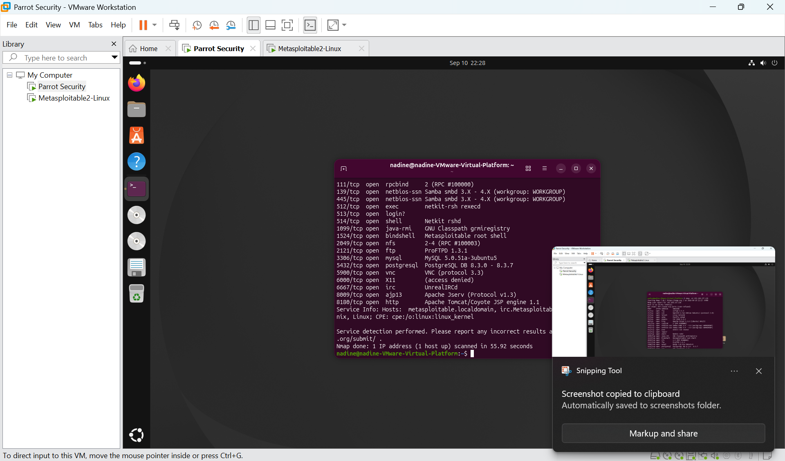
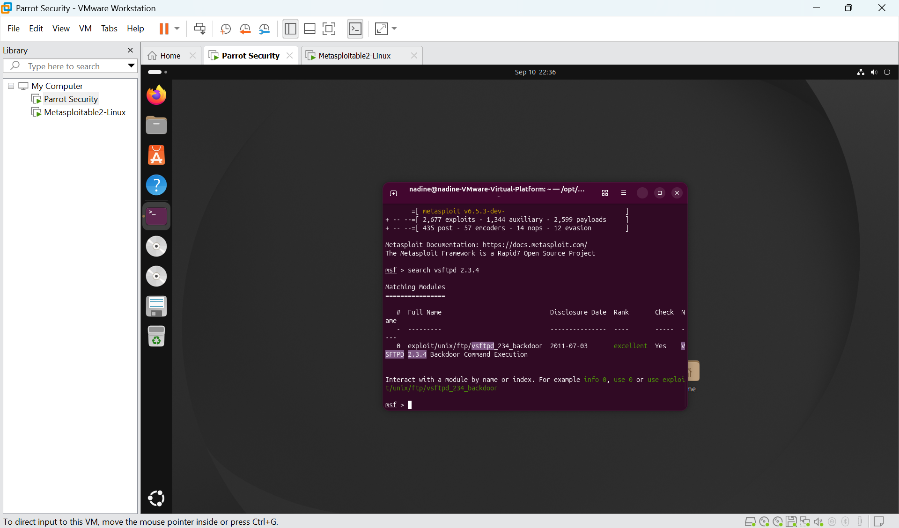
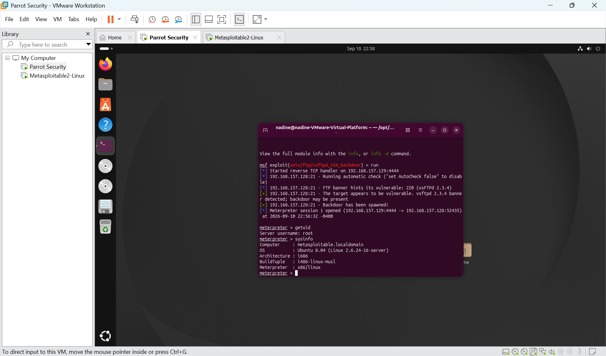

# 🔴 Parrot Security Penetration Testing Lab

## Overview

This project demonstrates a controlled penetration test performed in an isolated virtual lab environment using **Parrot Security** as the attacking system and **Metasploitable2** as the intentionally vulnerable target.

The objective was to follow a structured penetration-testing workflow: establish connectivity, enumerate exposed services, identify a potential vulnerability, validate the finding through controlled exploitation, and verify the resulting level of access.

> **Ethical Use Disclaimer:** All testing was performed against an intentionally vulnerable Metasploitable2 virtual machine in an isolated lab environment. No unauthorized systems were targeted.

---

## 🧰 Lab Environment

| Component | Purpose |
|---|---|
| Parrot Security | Attacker / penetration-testing workstation |
| Metasploitable2 | Intentionally vulnerable target |
| VMware | Virtualized isolated lab environment |
| Nmap | Network and service enumeration |
| Metasploit Framework | Vulnerability validation and controlled exploitation |

**Attacker IP:** `192.168.157.129`  
**Target IP:** `192.168.157.128`

---

## 1. Connectivity Verification

Before beginning the assessment, connectivity between the Parrot Security attacker and Metasploitable2 target was verified.

**Command used:** `ping -c 4 192.168.157.128`

The target responded successfully with **0% packet loss**, confirming communication within the isolated lab network.

---

## 2. Service Enumeration

Nmap service-version detection was used to identify exposed services on the target.

**Command used:** `nmap -sV 192.168.157.128`

The scan revealed multiple exposed services, including FTP, SSH, Telnet, HTTP, Samba, MySQL, PostgreSQL, VNC, and others.

Of particular interest was:

- **Port:** 21/TCP
- **Service:** FTP
- **Version:** vsftpd 2.3.4

---

## 3. Vulnerability Identification

The identified FTP service and version were researched using the **Metasploit Framework**.

**Search performed:** `search vsftpd 2.3.4`

Metasploit identified the following module:

`exploit/unix/ftp/vsftpd_234_backdoor`

This module corresponds to the **VSFTPD 2.3.4 Backdoor Command Execution vulnerability (CVE-2011-2523).**

---

## 4. Controlled Exploitation

The Metasploit module was configured specifically for the authorized Metasploitable2 target.

**Module used:** `exploit/unix/ftp/vsftpd_234_backdoor`

The target was configured as:

**RHOSTS:** `192.168.157.128`  
**RPORT:** `21`

The exploit successfully triggered the vulnerable service and established a **Meterpreter session** on the target.

---

## 5. Post-Exploitation Verification

After obtaining a session, read-only commands were used to verify the access level and identify the compromised lab system.

**Commands used:** `getuid` and `sysinfo`

The session reported:

**Server username:** `root`

System information confirmed that the active session was connected to the Metasploitable target.

This demonstrated that successful exploitation resulted in **root-level access** to the intentionally vulnerable system.

---

## 🔐 Security Impact

Successful exploitation of this vulnerability can result in unauthorized remote command execution and potentially complete compromise of an affected system.

In this controlled lab, exploitation resulted in a session operating with **root privileges**, demonstrating the critical security impact associated with vulnerable or compromised software.

An attacker obtaining this level of access could potentially gain extensive control over the affected host.

---

## 🛡️ Remediation

Recommended defensive actions include:

- Do not use vulnerable or untrusted builds of vsftpd.
- Upgrade or replace outdated software with supported versions obtained from trusted sources.
- Remove unnecessary externally accessible services.
- Restrict FTP access through appropriate network controls.
- Regularly perform vulnerability scanning and patch management.
- Monitor systems and network traffic for unexpected services or suspicious connections.
- Apply least-privilege principles wherever possible.

---

## 🧠 Skills Demonstrated

- Penetration testing methodology
- Parrot Security
- Linux security tools
- Network reconnaissance
- Nmap service enumeration
- Service and version analysis
- Vulnerability research
- CVE identification
- Metasploit Framework
- Exploit configuration
- Controlled vulnerability validation
- Post-exploitation verification
- Security impact analysis
- Remediation recommendations
- Technical documentation

---

## 🔄 Penetration Testing Workflow

**Connectivity Verification → Service Enumeration → Vulnerability Identification → Exploit Configuration → Controlled Exploitation → Access Verification → Remediation**

---

## ⚠️ Disclaimer

This project was conducted strictly for educational and cybersecurity training purposes in an isolated virtual environment using an intentionally vulnerable target.

The techniques demonstrated in this repository should only be used against systems you own or have explicit authorization to test.
